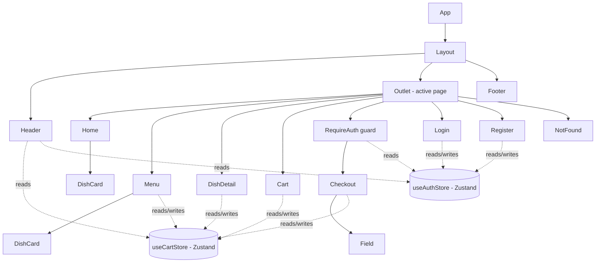

# Component Tree — Mesob House

## What owns what

| Component | Owns |
|---|---|
| `Layout` | Nothing — pure shell (Header + page + Footer) |
| `Header` | Nothing local — reads cart count & auth user from stores |
| `Home` | Nothing local — fetches specials via `useFetch` |
| `Menu` | Search text, selected category, toast message |
| `DishDetail` | Toast message |
| `Cart` | Nothing local — all data from `useCartStore` |
| `Checkout` | `orderPlaced`, `serverError` — form fields owned by React Hook Form |
| `Login` / `Register` | Form fields, error message |
| `DishCard` | Nothing — pure presentational, all props |
| `Field` | Nothing — pure presentational, all props |

## Global stores (outside the component tree)

- **`useCartStore`** (Zustand + persist) — `items`, `addItem`, `removeItem`, `updateQuantity`, `clearCart`
- **`useAuthStore`** (Zustand + persist) — `user`, `users`, `register`, `login`, `logout`
- 
